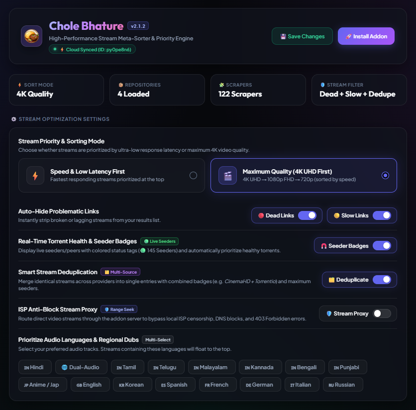

<div align="center">

  

  # Chole Bhature
  ### High-Performance Stream Meta-Sorter & Discovery Hub for Nuvio & Stremio

  [](https://github.com/SA7ANI/chole-bhature)
  [](https://github.com/SA7ANI/chole-bhature)
  [](LICENSE)
  [](https://github.com/SA7ANI)

  <br><br>

  

</div>

---

## 🌟 Overview

**Chole Bhature** is an enterprise-grade stream meta-sorter, provider priority engine, and IPTV discovery hub designed for **Nuvio** and **Stremio**. 

Instead of waiting through buffering wheels or clicking dead links, Chole Bhature intercepts stream requests from **120+ scrapers across multiple provider repositories**, concurrently **live-probes every stream for latency and health**, eliminates duplicate mirrors, resolves Debrid torrents, and serves a cleanly organized, deterministic stream list tailored to your exact audio, quality, and speed preferences.

---

## ✨ Key Features

| Feature | Description |
| :--- | :--- |
| ⚡ **Real-Time Latency Probing** | Concurrently tests HTTP/HLS streams via lightweight `Range`/`HEAD` probes. Dynamically tags links with `🟢 FAST (<800ms)`, `🟡 SLOW (≥800ms)`, or `🔴 DEAD`. |
| 💎 **Debrid Premium Resolvers** | Add your Real-Debrid, AllDebrid, or Torbox API key to unrestrict cached torrents. Replaces magnets with high-speed direct CDN links tagged with `⚡ [RD+]`, `⚡ [AD+]`, or `⚡ [TB+]`. |
| 📡 **Live TV & IPTV Playlist Studio** | Pro-grade IPTV player with 1-click curated public broadcasts, interactive Channel Explorer, live stream latency tester, custom M3U/M3U8 URLs, and Xtream Codes login. |
| 📺 **Curated Discovery Feeds** | Native catalog feeds for **Popular Right Now**, **Trending Indian Cinema**, **Anime**, and **Live TV** (`News`, `Sports`, `Movies`, `Music`, `India`, `USA`, etc.) with sub-category filters in Stremio & Nuvio. |
| 🛑 **Scraper Quarantine System** | Automatically isolates failing or unresponsive scrapers for 10 minutes after consecutive errors, eliminating scrape timeout penalties. |
| 🎛️ **Granular Source Management** | Enable or disable individual scrapers or bulk-toggle entire provider repositories with a single click in the Sources tab. |
| 🎬 **Strict 4K UHD Hierarchy** | Strict resolution-first ordering (`4K UHD` > `1080p FHD` > `720p HD` > `480p SD`). Lower quality releases never leapfrog 4K streams in Quality mode. |
| 🚫 **Auto-Hide CAM & Theater Rips** | Automatically identifies and filters out blurry recordings (`CAM`, `HDCAM`, `TeleSync`, `TC`, and `Screeners`). |
| 🧲 **Smart P2P Swarm Health** | Accurately maps torrent swarm seeders to health badges (`🟢 20+ Healthy`, `🟡 5–19 Moderate`, `🔴 1–4 Buffering Risk`) to prevent stalled playback. |
| 🌐 **Regional & Multi-Audio Priority** | Float your preferred audio languages (`Hindi`, `Tamil`, `Telugu`, `Malayalam`, `Dual-Audio`, `English`, `Anime/Jap`, etc.) directly to the top of your stream list. |
| 🛡️ **DNS-over-HTTPS (DoH)** | Built-in DoH engine supporting Cloudflare, Google, AdGuard, and Quad9 resolvers with zero-latency DNS caching to bypass ISP domain blocks. |
| 📊 **Real-Time Telemetry & Diagnostics** | Diagnostic dashboard with live RAM RSS gauges, cache hit ratios, and scraper health stats. |
| 🚀 **Stale-While-Revalidate Cache** | Serves cached streams instantly while asynchronously re-validating scrapers in the background for sub-50ms repeat requests. |

---

## 🚀 Getting Started

### 💻 Running Locally or on a Server / VPS

```bash
# 1. Clone the repository
git clone https://github.com/SA7ANI/chole-bhature.git
cd chole-bhature

# 2. Install dependencies
npm install

# 3. Start the server
npm start
```

Visit [http://localhost:7000/configure](http://localhost:7000/configure) in your browser.

---

## 🎛️ Intelligent Sorting Modes

Choose your preferred ranking algorithm in the dashboard:

1. **⚡ Speed & Low Latency First (Default)**: Ranks streams strictly by millisecond response time, delivering the fastest playing links at the very top.
2. **🎬 Maximum Quality (4K UHD First)**: Enforces strict resolution tiers (`4K UHD` > `1080p FHD` > `720p HD`), sorted by ping speed and release quality (`REMUX` > `BluRay` > `WEB-DL`) within each tier.
3. **⚖️ Smart Balanced**: High-efficiency matrix prioritizing `4K Fast` > `1080p Fast` > `4K Slow` > `1080p Slow` > `720p Fast`.
4. **🧲 P2P Seeders First**: Organizes torrent streams by highest verified active seeders and swarm health.

---

## 📡 Live TV & IPTV Playlist Studio

Chole Bhature includes a complete IPTV subsystem:
* **Curated 24/7 Channels**: Free legal news, sports, music, and regional broadcasts from around the world.
* **Custom M3U/M3U8 URLs**: Paste your own playlist link; Chole Bhature parses TVG metadata and categorizes channels automatically.
* **Xtream Codes API**: Enter your server URL, username, and password to load live channels directly into Stremio/Nuvio.
* **Stream Prober**: Test any live channel's latency, status, and content type before playback.

---

## 🛠️ Diagnostics & Admin Dashboard

Under the **Diagnostics & Admin** tab, you can monitor and manage your deployment:
* **Real-Time Memory & Headroom**: Track active RSS usage, heap memory, and buffer headroom.
* **Telemetry Profiler**: Live request latency tracking, cache hit/miss analytics, and scraper health metrics.
* **Scraper Quarantine Inspector**: View temporarily isolated or failing providers with countdown timers.
* **Granular Overrides**: Set custom scraper domain mirrors and request headers directly from the web interface.

---

## 🛠️ Tech Stack & Architecture

* **Runtime:** Node.js (v18+)
* **Server Framework:** Express.js (High-performance HTTP API & Stremio Addon Router)
* **SDK:** Stremio Addon SDK (`stremio-addon-sdk`)
* **Scraper Engine:** Axios, Cheerio, Crypto-JS, Node-Fetch
* **DNS Resolver:** DNS-over-HTTPS (DoH) via Axios with Native DNS fallback
* **Frontend:** Vanilla HTML5, Modern CSS3 Glassmorphism, Offline PWA Service Worker

---

## ⚖️ Attribution & Anti-Leech Policy

This project is free and open-source under the **GNU Affero General Public License v3.0 (AGPL-3.0)**.

If you fork, self-host, or redistribute any portion of this software (including modified versions running over a network or container service):
1. **Mandatory Credit**: You **MUST** retain visible attribution to the original author (**SA7ANI**) and link back to the official repository: [`https://github.com/SA7ANI/chole-bhature`](https://github.com/SA7ANI/chole-bhature).
2. **No De-Branding**: Stripping author credits, repository links, or branding from the UI, API responses, terminal logs, or manifest without explicit permission is a direct violation of the GNU AGPLv3 license terms.
3. **Open Source Requirement**: Any network-accessible deployment running modified code must provide the full corresponding source code under the same AGPL-3.0 license.

---

## 📝 License & Copyright

Copyright (C) 2026 **SA7ANI** (<https://github.com/SA7ANI/chole-bhature>)

Licensed under the **GNU Affero General Public License v3.0 (AGPL-3.0)**. See the [LICENSE](LICENSE) and [NOTICE](NOTICE) files for full legal terms.
